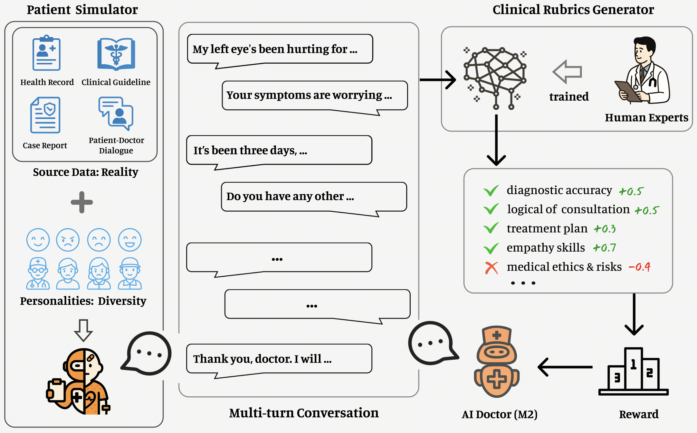

<div align="center">

# Baichuan-M2-32B

[](https://opensource.org/licenses/Apache-2.0)
[](https://huggingface.co/baichuan-inc/Baichuan-M2-32B)
[](https://huggingface.co/baichuan-inc/Baichuan-M2-32B-GPTQ-Int4)
[](https://modelers.cn/models/Baichuan/Baichuan-M2-32B-W8A8)

<h4 align="center">
    <p>
        <b>中文</b> |
        <a href="https://github.com/baichuan-inc/Baichuan-M2-32B/blob/main/README_en.md">English</a>
    <p>
</h4>

</div>

## 🌟 模型简介

Baichuan-M2-32B 是百川智能推出的医疗增强推理模型，这是百川开源发布的第二个医疗增强模型，专为真实世界的医疗推理任务设计。该模型基于 Qwen2.5-32B 基座，通过创新的大型验证器系统（Large Verifier System）从真实世界的医疗问题出发，进行医疗领域后训练对齐，在保持模型通用能力的同时，实现了医疗效果的突破性提升。

**模型特点：**

Baichuan-M2 采用了三个核心技术创新：首先通过**大型验证器系统**，结合医疗场景特点设计了全面的医疗验证体系，包含患者模拟器和多维度验证机制；其次通过**医疗领域适应性增强**的中期训练（Mid-Training），在保持通用能力的同时实现轻量高效的医疗领域适应；最后采用**多阶段强化学习**策略，将复杂的 RL 任务分解为层次化的训练阶段，逐步提升模型的医学常识、推理和患者交互能力。

**核心亮点：**
- 🏆 **全球最强医疗开源模型**：在 HealthBench 评测集上超越所有开源模型及众多前沿闭源模型，是最接近 GPT-5 医疗能力的开源大模型
- 🧠 **医生思维对齐**：基于真实病例数据和患者模拟器训练，具备临床诊断思维和鲁棒的医患交互能力
- ⚡ **高效部署与推理**：支持 4bit 量化在 RTX4090 单卡部署，MTP 版本单用户场景下 token 吞吐提升 58.5%


## 📊 性能表现

### HealthBench指标

| 模型名称 | HealthBench | HealthBench-Hard | HealthBench-Consensus |
|----------|-------------|------------------|-----------------------|
| Baichuan-M2 | 60.1 | 34.7 | 91.5 |
| gpt-oss-120b | 57.6 | 30 | 90 |
| Qwen3-235B-A22B-Thinking-2507 | 55.2 | 25.9 | 90.6 |
| Deepseek-R1-0528 | 53.6 | 22.6 | 91.5 |
| GLM-4.5 | 47.8 | 18.7 | 85.3 |
| Kimi-K2 | 43 | 10.7 | 90.9 |
| gpt-oss-20b | 42.5 | 10.8 | 82.6 |

### 通用指标

| 评测集 | Baichuan-M2-32B | Qwen3-32B (thinking) |
|--------|-----------------|-----------|
| AIME24 | 83.4 | 81.4 |
| AIME25 | 72.9 | 72.9 |
| Arena-Hard-v2.0 | 45.8 | 44.5 |
| CFBench | 77.6 | 75.7 |
| WritingBench | 8.56 | 7.90 |

*备注：AIME 的 max_tokens 设为 64k，其他评测集设为 32k，temperature 统一为 0.6。*


## 🛠️ 技术特色

📗 **技术博客**：[Blog - Baichuan-M2](https://www.baichuan-ai.com/blog/baichuan-M2)

### 大型验证器系统
- **患者模拟器**：基于真实病例构建的虚拟患者系统
- **多维度验证**：医学准确性、回答完整性、追问感知等 8 个维度
- **动态评分**：实时生成评分标准，适应复杂临床环境

### 医疗领域适应
- **Mid-Training**：医疗知识注入的同时保持通用能力
- **强化学习**：多阶段 RL 策略优化
- **通专兼顾**：精心配比的医疗、通用与数学领域复合数据

<div align="center">
  
</div>

## 🔧 快速开始

```python
# 1. load model
from transformers import AutoTokenizer, AutoModelForCausalLM
model = AutoModelForCausalLM.from_pretrained("baichuan-inc/Baichuan-M2-32B", trust_remote_code=True)
tokenizer = AutoTokenizer.from_pretrained("baichuan-inc/Baichuan-M2-32B")
# 2. Input prompt text
prompt = "Got a big swelling after a bug bite. Need help reducing it."
# 3. Encode the input text for the model
messages = [
    {"role": "user", "content": prompt}
]
text = tokenizer.apply_chat_template(
    messages,
    tokenize=False,
    add_generation_prompt=True,
    thinking_mode='on' # on/off/auto
)
model_inputs = tokenizer([text], return_tensors="pt").to(model.device)
# 4. Generate text
generated_ids = model.generate(
    **model_inputs,
    max_new_tokens=4096
)
output_ids = [
    output_ids[len(input_ids):] for input_ids, output_ids in zip(model_inputs.input_ids, generated_ids)
][0]
# 5. parsing thinking content
try:
    # rindex finding 151668 (</think>)
    index = len(output_ids) - output_ids[::-1].index(151668)
except ValueError:
    index = 0

thinking_content = tokenizer.decode(output_ids[:index], skip_special_tokens=True).strip("\n")
content = tokenizer.decode(output_ids[index:], skip_special_tokens=True).strip("\n")

print("thinking content:", thinking_content)
print("content:", content)

```

## ⚠️ 使用须知

1. **医疗免责声明**：本模型仅供研究和参考，不能替代专业医疗诊断和治疗建议
2. **适用场景**：医学教育、健康咨询、临床辅助决策等
3. **安全使用**：建议在专业医疗人员指导下使用

## 📄 许可证

本项目采用 [Apache License 2.0](LICENSE) 开源协议，欢迎研究和商业使用。

## 🤝 致谢

- 基础模型：Qwen2.5-32B
- 训练框架：verl
- 推理引擎：vLLM、SGLang
- 量化方法：AutoRound、GPTQ

感谢开源社区的贡献，我们将持续回馈社区，推动医疗 AI 技术发展。

## 📞 联系我们

- 更多资源：[百川智能官网](https://www.baichuan-ai.com)

- 技术交流：[GitHub](https://github.com/baichuan-inc)

---

<div align="center">

**让AI助力医疗，让健康触手可及**

</div>